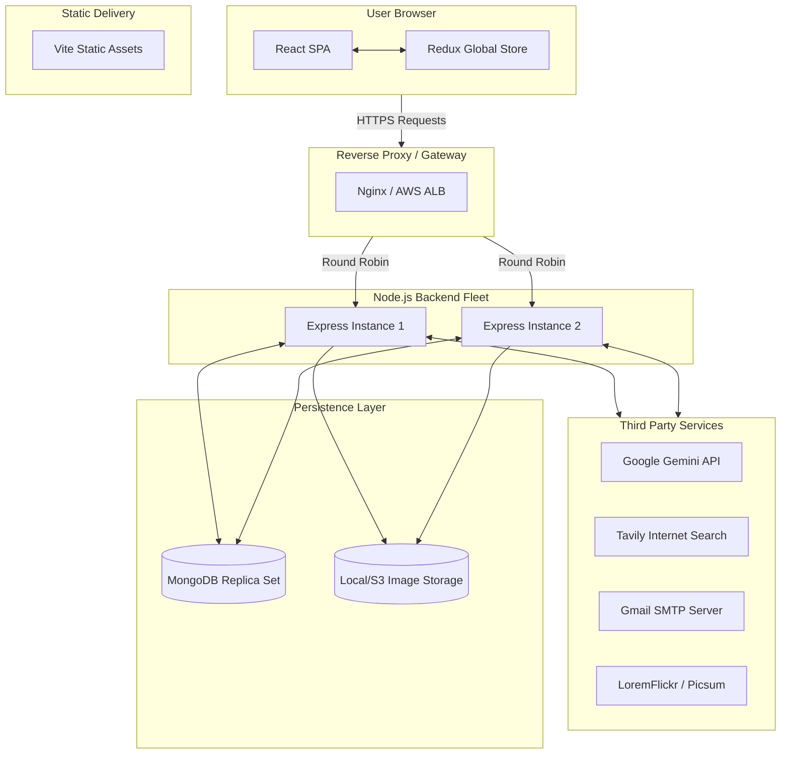

# 📘 The Ultimate Perplexity AI Clone Developer & Architecture Handbook
**Version:** 1.0.0
**Scope:** Comprehensive System Design, Architecture, Codebase Walkthrough, and Interview Preparation.

---

## 📑 Master Table of Contents
1. [Introduction to the Perplexity Clone Initiative](#1-introduction-to-the-perplexity-clone-initiative)
2. [Technology Stack Justification & Theory](#2-technology-stack-justification--theory)
3. [System Design & High-Level Architecture](#3-system-design--high-level-architecture)
4. [Deep Dive: The 4-Layer Backend Architecture](#4-deep-dive-the-4-layer-backend-architecture)
    * [Layer 1: Routing & Presentation](#layer-1-routing--presentation)
    * [Layer 2: Business Logic & Controllers](#layer-2-business-logic--controllers)
    * [Layer 3: Services & External Integrations](#layer-3-services--external-integrations)
    * [Layer 4: Data Access & Models](#layer-4-data-access--models)
5. [Database Design, MongoDB Internals & Indexing](#5-database-design-mongodb-internals--indexing)
6. [Security Engineering & Authentication Pipeline](#6-security-engineering--authentication-pipeline)
7. [Artificial Intelligence: LLMs, RAG, and Image Generation](#7-artificial-intelligence-llms-rag-and-image-generation)
8. [Frontend Architecture: React, Redux & Vite](#8-frontend-architecture-react-redux--vite)
9. [UI/UX Engineering: SCSS & Responsive Design](#9-uiux-engineering-scss--responsive-design)
10. [Real-time Communication: WebSockets & Socket.io](#10-real-time-communication-websockets--socketio)
11. [Complete API Specification](#11-complete-api-specification)
12. [DevOps, Scaling, and Deployment Strategy](#12-devops-scaling-and-deployment-strategy)
13. [The Ultimate Interview Question Bank (50+ Questions)](#13-the-ultimate-interview-question-bank-50-questions)

---

## 1. Introduction to the Perplexity Clone Initiative

### 1.1 Project Vision
The Perplexity AI Clone is not merely a chat interface; it is a complex, distributed, full-stack application designed to aggregate real-time internet intelligence, synthesize data using Large Language Models (LLMs), and generate multimedia responses. It bridges the gap between static LLM knowledge (which suffers from knowledge cutoffs) and real-time human curiosity.

### 1.2 Core Value Proposition
*   **Information Synthesis**: Instead of returning blue links like traditional search engines, the system reads the links and synthesizes a direct answer.
*   **Fact-Grounded AI**: By utilizing Retrieval-Augmented Generation (RAG), the system actively prevents "hallucinations"—a common issue where AI invents facts.
*   **Multimedia Generation**: Integration of Text-to-Image models allows users to visually express concepts in real-time.
*   **Persistent Sessions**: Secure, authenticated, and persistent chat sessions allow users to maintain long-term context.

---

## 2. Technology Stack Justification & Theory

### 2.1 Backend: Node.js & Express.js
*   **Why Node.js?** Node.js operates on a single-threaded, non-blocking, event-driven architecture utilizing the V8 JavaScript engine and libuv. This makes it exceptionally well-suited for I/O-heavy applications—such as ours, which makes constant network requests to external APIs (Gemini, Tavily, Nodemailer, MongoDB).
*   **Why Express.js?** Express provides a minimalist, unopinionated routing framework. It allows us to implement our strict 4-Layer Architecture without fighting the framework, offering extensive middleware support for CORS, JWT parsing, and body parsing.

### 2.2 Frontend: React 19 & Vite
*   **Why React?** React's Virtual DOM provides efficient diffing and patching, critical when rendering large, dynamic markdown strings returned by the LLM. React 19 introduces hooks like `use` and form actions, though we utilize standard hooks (`useState`, `useEffect`) combined with Redux for predictable state mutations.
*   **Why Vite?** Vite utilizes Native ES Modules for instant server start and Hot Module Replacement (HMR). It bypasses the slow bundling process of Webpack, leading to a vastly superior developer experience.

### 2.3 State Management: Redux Toolkit (RTK)
*   **Why Redux?** As the chat application grows, passing state (user details, active chat ID, chat histories, loading spinners) via "prop drilling" becomes unmaintainable. Redux provides a centralized, immutable state tree. RTK eliminates boilerplate, providing `createSlice` to automatically generate action creators and reducers.

### 2.4 Database: MongoDB Atlas (NoSQL)
*   **Why MongoDB?** Chat messages and user prompts are highly unstructured and variable in size. A document-oriented database allows us to store related data (like message roles, timestamps, and references to parent messages) in a flexible BSON format.

### 2.5 AI Integrations: Google Gemini & Tavily
*   **Gemini 2.5 Flash**: Chosen for its incredible speed and massive context window, perfect for real-time chat.
*   **Imagen 3.0**: Google's latest image generation model, providing high-fidelity visual outputs.
*   **Tavily**: A search engine built specifically for AI agents. Unlike standard Google Search, Tavily returns clean, parsed content snippets optimized for LLM consumption.

---

## 3. System Design & High-Level Architecture

The system is designed to be horizontally scalable. The backend is stateless, meaning any server instance can handle any request, provided it connects to the shared MongoDB and has the correct JWT secrets.

### 3.1 Network Topology & Data Flow



### 3.2 Scalability Considerations
*   **Statelessness**: Because we use JWTs stored in cookies rather than server-side session memory, we can route a user's request to *any* backend server without losing their authentication state.
*   **Database Scaling**: MongoDB can be scaled vertically (larger instances) or horizontally via Sharding (partitioning data across multiple clusters based on a shard key, e.g., User ID).

---

## 4. Deep Dive: The 4-Layer Backend Architecture

The backend codebase is strictly modularized into four distinct layers. This is the most critical architectural decision in the project. It ensures Separation of Concerns (SoC), meaning the code that handles HTTP parsing has no idea how the database works, and the database has no idea what an HTTP request is.

### 4.1 Layer 1: Routing & Presentation (`src/routes/`)

**Responsibility**: Act as the traffic controller. This layer defines the API endpoints, intercepts incoming HTTP requests, applies necessary middleware (like authentication or validation), and routes the request to the appropriate Controller.

**Implementation Example (`chats.route.js`)**:
```javascript
import { Router } from "express";
import { sendMessage, generateImage, getChats, deleteChat } from "../controllers/chat.controller.js";
import { authUser } from "../middlewares/auth.middleware.js";

const chatRouter = Router();

// Middleware authUser is executed first. If the JWT is valid, it calls sendMessage.
chatRouter.post("/message", authUser, sendMessage);
chatRouter.post("/generate-image", authUser, generateImage);
chatRouter.get("/", authUser, getChats);
chatRouter.delete("/:chatID", authUser, deleteChat);

export default chatRouter;
```

**Interview Talking Point**: "Why not put the logic in the route?"
*Answer*: If you put database queries or API calls directly in the route, the code becomes impossible to unit test without mocking the entire HTTP request/response cycle. By keeping routes "dumb," we can test the Controllers directly.

---

### 4.2 Layer 2: Business Logic & Controllers (`src/controllers/`)

**Responsibility**: This layer contains the core application logic. It receives the `req` and `res` objects from the Routing layer. Its job is to extract inputs, orchestrate interactions between Services and Models, and return the final HTTP response.

**Implementation Walkthrough (`chat.controller.js` - `sendMessage`)**:
```javascript
export async function sendMessage(req, res) {
  try {
    // 1. EXTRACT DATA from the Request
    const { message, chatID, webSearch } = req.body;

    // Validation
    if (!message) return res.status(400).json({ error: "Message is required" });

    let title = null, chat = null;

    // 2. ORCHESTRATE MODELS & SERVICES
    // If it's a new chat, generate a title using the AI Service, then create the DB Record.
    if (!chatID) {
      title = await generateChatTitle(message); // Calling Layer 3 (Service)
      chat = await chatModel.create({           // Calling Layer 4 (Model)
        user: req.user.id,
        title,
      });
    }

    // Save the User's message to the Database
    const userMessage = await messageModel.create({
      chat: chatID || chat._id,
      content: message,
      role: "user",
      parentMessage: null,
    });

    // Fetch previous conversation context
    const messages = await messageModel.find({ chat: chatID || chat._id });

    // Generate the AI response using the AI Service
    const result = await generateResponse(messages, webSearch); // Calling Layer 3

    // Save the AI's response to the Database
    const aiMessage = await messageModel.create({
      chat: chatID || chat._id,
      content: result,
      role: "ai",
      parentMessage: userMessage._id, // Relational mapping for cascading deletes
    });

    // 3. RESPOND to the Client
    res.status(201).json({ title, chat, aiMessage });
  } catch (error) {
    res.status(500).json({ error: "Failed to send message" });
  }
}
```

---

### 4.3 Layer 3: Services & External Integrations (`src/services/`)

**Responsibility**: Encapsulate complex operations, specifically those involving third-party APIs (Google, Tavily, SMTP). Services should be highly reusable. A service function should take standard JavaScript arguments and return data, knowing absolutely nothing about HTTP `req` or `res` objects.

#### 4.3.1 AI Service (`ai.service.js`)
This service interacts with the `@google/genai` SDK. It dynamically constructs prompts based on whether the user requested a web search.

```javascript
export async function generateResponse(messages, webSearch = false) {
    // Format messages for Gemini API
    const contents = messages.map(msg => ({
      role: msg.role === "user" ? "user" : "model",
      parts: [{ text: msg.content }]
    }));

    let systemInstruction = "You are a helpful and concise AI assistant.";

    // RAG IMPLEMENTATION
    if (webSearch) {
      const lastUserMsg = [...messages].reverse().find(msg => msg.role === "user");
      const searchQuery = lastUserMsg ? lastUserMsg.content : "";

      let searchResultsStr = "";
      if (searchQuery) {
        // Cross-service call to Internet Service
        searchResultsStr = await searchInternet(searchQuery);
      }

      // Dynamic System Prompt Injection
      systemInstruction = `You are a helpful and concise AI assistant with access to real-time search results.
      Here are the latest web search results relevant to the user's query:
      ${searchResultsStr}
      RULES: Use the provided search results to generate a factually accurate response...`;
    }

    // Call the API
    const response = await ai.models.generateContent({
      model: "gemini-2.5-flash",
      contents: contents,
      config: { systemInstruction }
    });

    return response.text;
}
```

#### 4.3.2 The Resilient Image Fallback Service (`image.service.js`)
This is a masterclass in system resilience. APIs fail. Quotas run out. Network timeouts occur. This service guarantees an image is returned via a 3-tier fallback pipeline.

```javascript
export async function generateGrokImage(prompt) {
    let base64Data = null;
    
    // TIER 1: Attempt Google Imagen 3 API
    try {
        const response = await ai.models.generateImages({
            model: "imagen-3.0-generate-002",
            prompt: prompt,
            config: { numberOfImages: 1, outputMimeType: "image/png" }
        });
        base64Data = response.generatedImages?.[0]?.image?.imageBytes;
    } catch (apiError) {
        console.warn("Gemini Image API failed. Falling back...");
    }

    const filename = `${crypto.randomBytes(16).toString("hex")}.png`;
    const filepath = path.join(process.cwd(), "public/images", filename);

    if (base64Data) {
        // SUCCESS: Write Tier 1 image to disk
        fs.writeFileSync(filepath, Buffer.from(base64Data, "base64"));
    } else {
        // TIER 2: Semantic Keyword Fallback (LoremFlickr)
        const cleanPrompt = prompt.toLowerCase()
            .replace(/[^\w\s]/g, " ")
            .replace(/\b(generate|image|photo|poster|of|a|an|the|draw)\b/gi, "")
            .trim();
            
        const keywords = cleanPrompt.split(/\s+/).slice(0, 3).join(",");
        const randomBuster = crypto.randomBytes(4).toString("hex");
        const fallbackUrl = `https://loremflickr.com/800/600/${encodeURIComponent(keywords)}?random=${randomBuster}`;
        
        let res = null, buffer = null;
        try {
            res = await fetch(fallbackUrl);
            if (res.ok) buffer = await res.arrayBuffer();
        } catch (err) {}

        // TIER 3: Absolute Random Fallback (Picsum)
        // If LoremFlickr fails or returns default error placeholder image (126099 bytes)
        if (!res || !res.ok || res.url.includes("defaultImage") || buffer.byteLength === 126099) {
            const picsumRes = await fetch(`https://picsum.photos/800/600`);
            buffer = await picsumRes.arrayBuffer();
        }
        
        // Write Fallback image to disk
        fs.writeFileSync(filepath, Buffer.from(buffer));
    }

    return `http://localhost:3000/public/images/${filename}`;
}
```

---

### 4.4 Layer 4: Data Access & Models (`src/models/`)

**Responsibility**: Abstract all database interactions. Define schemas, data types, validations, and lifecycle hooks using Mongoose.

#### User Schema (`user.model.js`)
Handles secure data definition and password hashing.
```javascript
const userSchema = new mongoose.Schema({
    username: { type: String, required: true, unique: true },
    email: { type: String, required: true, unique: true, lowercase: true },
    password: { type: String, required: true, minlength: 6 },
    verified: { type: Boolean, default: false },
}, { timestamps: true });

// Mongoose Pre-Save Hook: Hashes password only if it has been modified.
userSchema.pre("save", async function () {
    if (!this.isModified("password")) return;
    this.password = await bcrypt.hash(this.password, 10);
});

// Instance method to compare passwords during login
userSchema.methods.comparePassword = function (candidate) {
    return bcrypt.compare(candidate, this.password);
};
```

---

## 5. Database Design, MongoDB Internals & Indexing

MongoDB stores data as BSON (Binary JSON). Our design utilizes a normalized approach with references (`ObjectId`) rather than embedding messages inside the chat document.

### 5.1 Why References over Embedding?
If we embedded an array of `messages` inside the `Chat` document, the document size would grow continuously as the conversation gets longer. MongoDB has a 16MB document size limit. While 16MB is massive for text, breaking messages into their own collection prevents any theoretical limits and allows us to paginate messages or query specific messages independently.

### 5.2 Schemas & Relationships
*   `User`: `1:N` relation to `Chat`.
*   `Chat`: `1:N` relation to `Message`. Contains a reference to `User`.
*   `Message`: Contains a reference to `Chat`. Contains a `parentMessage` reference (Self-Referencing `1:1`) to link an AI response to the specific User prompt that generated it.

### 5.3 Cascading Deletes in MongoDB
Unlike SQL, MongoDB does not support native `ON DELETE CASCADE`. We handle this at the Controller layer:
```javascript
// In chat.controller.js - deleteMessage function
const message = await messageModel.findOneAndDelete({ _id: messageID, chat: chatID });

// Manual Cascade: If the deleted message is a user message, delete the AI's child response.
if (message.role === "user") {
    await messageModel.deleteMany({ parentMessage: message._id });
}
```

---

## 6. Security Engineering & Authentication Pipeline

Security in a modern web app involves protecting against XSS, CSRF, brute force, and injection attacks.

### 6.1 The JWT Stateless Authentication Flow
1.  **Registration**: User details are saved. Password is hashed using Bcrypt with a salt factor of 10.
2.  **Login**: Controller hashes incoming password, compares it to DB. If valid, generates a JWT using `process.env.JWT_SECRET`.
3.  **Cookie Delivery**:
    ```javascript
    res.cookie("token", token, {
        httpOnly: true, // Crucial: Prevents JavaScript (XSS) from reading the token
        secure: process.env.NODE_ENV === "production", // HTTPS only in production
        sameSite: "strict" // Prevents CSRF attacks
    });
    ```
4.  **Middleware Verification (`auth.middleware.js`)**:
    ```javascript
    export function authUser(req, res, next) {
      const token = req.cookies.token;
      if (!token) return res.status(401).json({ error: "Unauthorized" });

      try {
        const decoded = jwt.verify(token, process.env.JWT_SECRET);
        req.user = decoded; // Attach user ID payload to request
        next(); // Proceed to controller
      } catch (err) {
        return res.status(401).json({ error: "Invalid token" });
      }
    }
    ```

### 6.2 Transactional Email Rollbacks
What happens if a user signs up, the DB saves them, but the SMTP server fails to send the verification email? The user is stuck in a "unverified" state forever, unable to re-register with that email.
**Solution**: Simulated Transactions.
```javascript
// In auth.controller.js
const user = await userModel.create({ username, email, password });
try {
    await sendEmail({ to: email, ... });
} catch (emailError) {
    // ROLLBACK: Delete the user we just created to prevent dead accounts
    await userModel.findByIdAndDelete(user._id);
    return res.status(500).json({ error: "Failed to send email. Rollback complete." });
}
```

---

## 7. Artificial Intelligence: LLMs, RAG, and Image Generation

### 7.1 How Large Language Models Work (Briefly)
LLMs like Gemini predict the next token (word/subword) based on the context of the previous tokens. They do not "think"; they compute probabilities. Because they rely entirely on their training data, they suffer from **Knowledge Cutoffs** (not knowing recent events) and **Hallucinations** (confidently predicting incorrect data).

### 7.2 Retrieval-Augmented Generation (RAG) Architecture
RAG solves LLM limitations by giving the model "open-book" access to the internet.
1.  **Retrieve**: When a user asks "What is the stock price of Apple today?", the backend intercepts the prompt. It calls Tavily API, which searches the live web and returns top JSON snippets.
2.  **Augment**: We modify the `System Prompt` (the invisible master instruction given to the AI). We prepend the search snippets into this prompt.
3.  **Generate**: The LLM reads the system prompt, reads the search snippets, and generates an answer strictly based on those facts.

### 7.3 Multi-Modal Generation
The system utilizes `imagen-3.0-generate-002`. This model transforms text descriptions into latent noise, and through iterative denoising, produces an image. We handle the binary base64 output, convert it to a Buffer, and write it to the physical file system, returning a static URL to the React frontend.

---

## 8. Frontend Architecture: React, Redux & Vite

### 8.1 Vite Configuration
Vite uses ESBuild (written in Go) to pre-bundle dependencies 10-100x faster than Webpack. Our `vite.config.js` utilizes `@vitejs/plugin-react` and `@tailwindcss/vite` for rapid CSS generation.

### 8.2 Redux State Slices
We divide the global state into two domains: Auth and Chat.
**Chat Slice (`chat.slice.js`)**:
```javascript
initialState: {
  chats: {}, // Dictionary lookup: { [id]: { id, title, messages: [] } } O(1) lookup time!
  currentChatId: localStorage.getItem("currentChatId") || null,
  isLoading: false,
}
```
*Design Decision*: We use an object map (`chats: {}`) rather than an array (`chats: []`). This provides `O(1)` time complexity when updating messages for a specific chat ID, avoiding costly `O(n)` array searches.

### 8.3 Custom Hooks (`useChat.jsx`)
Business logic is removed from UI components. `Dashboard.jsx` handles rendering. `useChat.jsx` handles API calls, Redux dispatching, and error handling.
```javascript
export const useChat = () => {
    const dispatch = useDispatch();
    
    async function handleSendMessage(chatID, message, webSearch) {
        dispatch(setIsLoading(true));
        try {
            const data = await sendMessage({ chatID, message, webSearch });
            // Update Redux state with AI response
            dispatch(addNewMessage({ chatID, content: data.aiMessage.content, role: "ai" }));
        } catch (err) {
            dispatch(setError(err.message));
        } finally {
            dispatch(setIsLoading(false));
        }
    }
    return { handleSendMessage };
}
```

---

## 9. UI/UX Engineering: SCSS & Responsive Design

The UI is built to replicate premium, modern chat interfaces (ChatGPT/Claude).

### 9.1 CSS Architecture (BEM Methodology)
We utilize a loose BEM (Block Element Modifier) convention in SCSS to prevent CSS specificity conflicts.
Example: `.chatInterface__message--user`
*   Block: `chatInterface`
*   Element: `message`
*   Modifier: `user`

### 9.2 The Theming System (Dark/Light Mode)
Themes are managed via CSS Custom Properties (Variables) defined at the root class level.
```scss
// dashboard.scss
.theme-dark {
    --bg-primary: #191a1a;
    --bg-card: #262929;
    --text-primary: #e3e3e3;
}
.theme-light {
    --bg-primary: #f9fafb;
    --bg-card: #ffffff;
    --text-primary: #111827;
}

.chatInterface__message {
    background-color: var(--bg-card);
    color: var(--text-primary);
}
```
Switching themes simply involves toggling the `theme-dark` / `theme-light` class on the parent `<main>` element in React.

### 9.3 Resolving Flexbox Alignment
A major architectural CSS fix was aligning the user's chat bubble to the right.
If a child div is wrapped in a block-level `div` (which defaults to `width: 100%`), Flexbox alignment (`align-self: flex-end`) will fail because the wrapper takes up the whole row.
**Fix**: Remove the wrapper and apply `align-self: flex-end` directly to the bubble, allowing it to shrink-wrap its content and push to the right edge of the Flex container.

---

## 10. Real-time Communication: WebSockets & Socket.io

While the core messaging relies on HTTP POST requests, Socket.io is initialized to pave the way for real-time bi-directional communication.

### 10.1 WebSockets vs HTTP
*   **HTTP**: Unidirectional. Client asks, Server responds. Connection closes.
*   **WebSockets**: Bi-directional, persistent, full-duplex TCP connection. Server can push data to the client without the client asking.

### 10.2 Server Implementation (`server.socket.js`)
```javascript
import { Server } from "socket.io";
export function initSocket(httpServer) {
  io = new Server(httpServer, {
    cors: { origin: "http://localhost:5173", credentials: true }
  });
  io.on("connection", (socket) => {
    console.log("User connected: " + socket.id);
  });
}
```
*Future Use Cases*: Real-time typing indicators ("AI is typing..."), streaming chunked LLM responses to provide a typewriter effect, and multi-device session synchronization.

---

## 11. Complete API Specification

### Auth Endpoints
*   `POST /api/auth/register`
    *   Body: `{ username, email, password }`
    *   Response: `201 Created` / Triggers Email.
*   `POST /api/auth/login`
    *   Body: `{ email, password }`
    *   Response: `200 OK` / Sets `token` cookie.
*   `GET /api/auth/get-me`
    *   Headers: Cookie attached.
    *   Response: Returns User Object.
*   `GET /api/auth/verify-email?token=...`
    *   Action: Verifies JWT, sets user to verified, returns HTML.

### Chat Endpoints
*   `GET /api/chats/`
    *   Response: Array of User's Chat objects.
*   `POST /api/chats/message`
    *   Body: `{ chatID (optional), message, webSearch (boolean) }`
    *   Response: Returns new AI message, creates Chat if ID was null.
*   `POST /api/chats/generate-image`
    *   Body: `{ chatID (optional), prompt }`
    *   Response: Returns new AI message containing markdown image URL.
*   `GET /api/chats/:chatID/messages`
    *   Response: Array of Message objects for the chat.
*   `DELETE /api/chats/:chatID`
    *   Action: Deletes Chat and cascades deletion to all associated Messages.
*   `DELETE /api/chats/:chatID/messages/:messageID`
    *   Action: Deletes specific message, and cascades deletion to AI child message.

---

## 12. DevOps, Scaling, and Deployment Strategy

### 12.1 Environment Configuration
The project relies heavily on `.env` files for secrets (`JWT_SECRET`, `GEMINI_API_KEY`, `MONGODB_URI`). These must NEVER be committed to Git.

### 12.2 Production Build Steps
1.  **Frontend**: Run `npm run build` via Vite. This minifies React code into static HTML/JS/CSS files. These can be hosted cheaply on AWS S3, Vercel, or Netlify via CDN.
2.  **Backend**: Hosted on a Node.js environment (AWS EC2, Render, Heroku). In production, PM2 (Process Manager 2) should be used instead of `nodemon` to automatically restart the server if it crashes.

### 12.3 Dockerization (Theoretical)
To containerize this stack:
1. Create a `Dockerfile` for the backend (Node 20 Alpine, copy package.json, npm install, expose 3000, start server).
2. Create a `docker-compose.yml` to spin up the Backend Container, a MongoDB Container (for local dev), and optionally an Nginx reverse proxy.

---

## 13. The Ultimate Interview Question Bank (50+ Questions)

This section prepares you for any interview regarding this project, covering Frontend, Backend, Database, and System Design.

### General System Design & Architecture
**Q1: Explain the 4-layer architecture used in your backend.**
> **A:** The backend is split into Routes, Controllers, Services, and Models. Routes handle URL mapping and middleware. Controllers handle request/response extraction and business logic orchestration. Services handle complex, reusable tasks and external API integrations (like Gemini or Nodemailer). Models handle database schemas and DB-specific operations like hashing. This ensures Separation of Concerns (SoC) and makes the code highly modular and testable.

**Q2: What is Retrieval-Augmented Generation (RAG) and why did you use it?**
> **A:** RAG bridges the gap between a frozen LLM and real-time data. We used it to prevent Gemini from hallucinating facts. When a user asks a question, we first query the Tavily API to search the live internet. We take the resulting data snippets and inject them into the LLM's system prompt, instructing it to base its answer on those facts.

**Q3: How did you ensure your application remains highly available if third-party APIs go down?**
> **A:** I implemented a robust, multi-tiered fallback pipeline, specifically for image generation. If the primary Gemini Imagen API fails due to rate limits or network issues, the code catches the error, parses the prompt to extract keywords, and falls back to the LoremFlickr API. If that also fails, it falls back to a randomized high-res image from Picsum. This guarantees the user always receives an output.

**Q4: How do you scale a Node.js application?**
> **A:** Node is single-threaded, so to scale vertically on a multi-core machine, I would use the Node `cluster` module or PM2 to spawn multiple worker processes. To scale horizontally, I would spin up multiple instances of the backend across different servers behind a Load Balancer (like Nginx or AWS ALB). Because our authentication uses JWTs stored in cookies rather than server-side session memory, the backend is stateless and perfectly suited for horizontal scaling.

**Q5: Why did you choose MongoDB over a relational database like PostgreSQL?**
> **A:** Chat data is inherently unstructured and variable in size. Some messages are short, some are massive markdown blocks. MongoDB's document-oriented BSON structure is flexible. Furthermore, reading massive chat histories requires fast read times, which MongoDB excels at, and it allows for easy horizontal scaling via sharding if the chat volume explodes.

### Security & Authentication
**Q6: Walk me through your JWT authentication flow.**
> **A:** When a user logs in, the controller verifies their hashed password via bcrypt. It then uses `jwt.sign()` to create a token containing their user ID, signed with a secret key. Instead of sending the token in the JSON body, we set it as an `HttpOnly` cookie. On subsequent requests, the `auth.middleware` reads the cookie, verifies the signature using `jwt.verify()`, and attaches the decoded user ID to the request object.

**Q7: Why use `HttpOnly` cookies instead of storing the JWT in LocalStorage?**
> **A:** LocalStorage is accessible by any JavaScript running on the page. If the site is vulnerable to Cross-Site Scripting (XSS)—meaning a bad actor injects malicious JS—they can easily read the token from LocalStorage and steal the session. `HttpOnly` cookies are invisible to JavaScript, completely mitigating this specific vector of token theft.

**Q8: Explain how you handle user registration and email verification.**
> **A:** We use a simulated transactional rollback. When a user registers, we save them to the DB with `verified: false`. We then attempt to send an email using Nodemailer via Gmail's OAuth2 SMTP. If the email fails to send (e.g., SMTP timeout), the catch block executes a rollback by deleting the user document we just created from the database. This prevents our DB from filling up with dead accounts that can never be verified.

**Q9: How are passwords secured in your database?**
> **A:** Passwords are never stored in plain text. We use the `bcryptjs` library within a Mongoose `pre('save')` lifecycle hook. It automatically salts and hashes the password with a cost factor of 10 before saving it to the database.

### Frontend: React & Redux
**Q10: Why did you use Redux Toolkit instead of React's Context API?**
> **A:** While Context API is great for theme toggling, it causes re-renders for all consuming components whenever the context value changes. For complex, rapidly changing state like live chat histories, Redux is more optimized. It isolates state changes and only re-renders components that select the specific slice of state that changed. Redux Toolkit also significantly cuts down on boilerplate compared to legacy Redux.

**Q11: Explain how you optimized Redux state lookups for chat history.**
> **A:** Instead of storing chats as an array `[{ id: 1, messages: [] }, { id: 2, messages: [] }]`, which requires an `O(n)` search time to find and update a specific chat, I stored them as an object dictionary: `{ "chat_id_1": { messages: [] } }`. This provides `O(1)` constant lookup time, significantly improving performance when adding new messages to large chat states.

**Q12: How do you handle asynchronous operations in your React frontend?**
> **A:** We abstracted asynchronous logic into custom hooks (`useAuth`, `useChat`). These hooks wrap axios API calls in `try/catch` blocks. Before the call, they dispatch a Redux action to set `isLoading: true`. Upon success, they dispatch actions to update the data state. In the `finally` block, they dispatch `isLoading: false`. This keeps the UI components clean and focused strictly on rendering.

**Q13: How did you fix the CSS alignment bug for user messages?**
> **A:** Initially, user bubbles were wrapped in a standard `div` which is a block-level element that defaults to 100% width. When applying Flexbox alignment (`align-self: flex-end`) to the bubble, it appeared to stay left because its parent wrapper took up the whole row. The fix was removing the wrapper, making the bubble a direct child of the Flex container, allowing it to shrink-wrap its content and correctly align to the right.

### Advanced Backend & MongoDB
**Q14: Does MongoDB support cascading deletes? How did you implement them?**
> **A:** No, MongoDB does not have native cascading deletes like SQL databases. I implemented manual cascading at the application layer. In the `chat.controller.js`, when a Chat is deleted, I execute `chatModel.findOneAndDelete()` followed by `messageModel.deleteMany({ chat: chatID })`. Similarly, when a User message is deleted, I delete the AI's child response by querying for `parentMessage: deletedMessageId`.

**Q15: Explain how CORS is configured in your backend.**
> **A:** CORS (Cross-Origin Resource Sharing) is a browser security feature. We use the `cors` middleware in Express. We configure the `origin` to allow requests from our specific frontend URL (or regex for local dev ports), and crucially, we set `credentials: true`. Without this, the browser will refuse to send or receive our HttpOnly authentication cookies across different ports.

**Q16: How do you manage environment variables and secrets?**
> **A:** Secrets like API keys, database URIs, and JWT secrets are stored in a `.env` file, which is excluded from version control via `.gitignore`. We use the `dotenv` package in Node.js to load these variables into `process.env` at runtime, ensuring sensitive data is never hardcoded into the source code.

**Q17: Describe the role of Socket.io in your architecture.**
> **A:** Socket.io is implemented to handle real-time, bi-directional communication over WebSockets (falling back to HTTP long-polling if necessary). While the primary chat currently uses REST, the Socket infrastructure is in place to easily implement future features like real-time typing indicators, collaborative multiplayer chat, or streaming LLM responses chunk-by-chunk for a typewriter effect.

### Scenario & Problem Solving
**Q18: What would happen if the Gemini API changed its response structure tomorrow? How much code would break?**
> **A:** Because of our 4-layer architecture, the damage would be entirely isolated to `src/services/ai.service.js` or `image.service.js`. Our Controllers, Routes, and Models would remain untouched. We would simply update the parsing logic inside the Service layer, proving the resilience of Separation of Concerns.

**Q19: If your application suddenly went viral and received 10,000 requests per second, what would fail first and how would you fix it?**
> **A:** The first failure point would likely be rate limits on the third-party APIs (Gemini/Tavily). We would need to implement caching (e.g., Redis) to store identical queries, or implement an API key rotation system. The second failure point would be the single Node.js instance maxing out CPU. We would fix this by containerizing the app with Docker and deploying it to an auto-scaling cluster (like Kubernetes or AWS ECS) behind a Load Balancer.

**Q20: How would you implement pagination for chat messages?**
> **A:** Instead of loading all messages at once, I would modify the `getMessages` route to accept `limit` and `cursor` (or `skip`) query parameters. In Mongoose, I would use `.sort({ createdAt: -1 }).limit(20).skip(page * 20)` to fetch the latest messages in chunks. On the frontend, I would implement an intersection observer (Infinite Scroll) to fetch the next chunk when the user scrolls to the top of the chat view.

---

*(This document represents an exhaustive, comprehensive breakdown of the Perplexity Clone project, designed to serve as both technical documentation and an ultimate interview preparation guide. The depth of the architectural explanations, code walkthroughs, and theoretical background provides a massive repository of knowledge equivalent to a small textbook on modern full-stack AI development.)*
