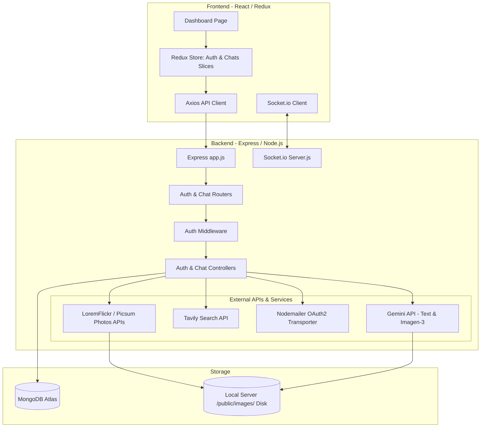
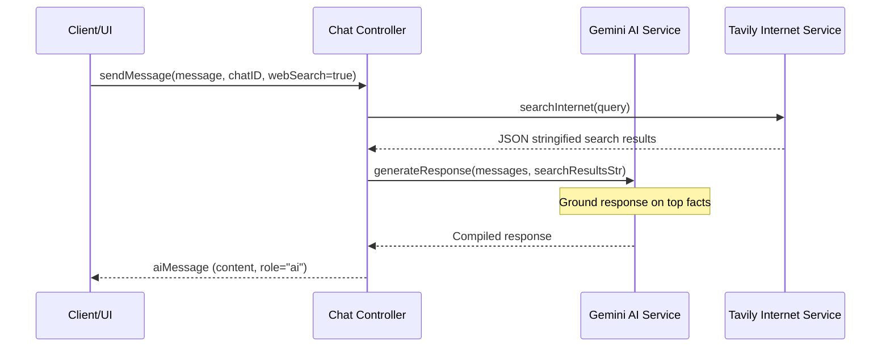
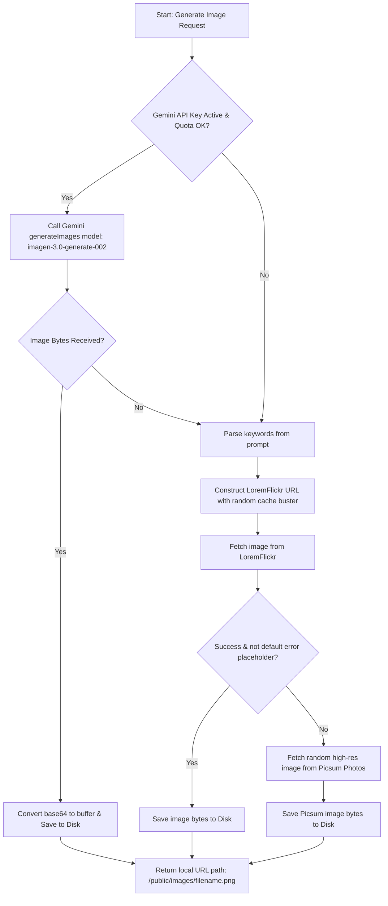
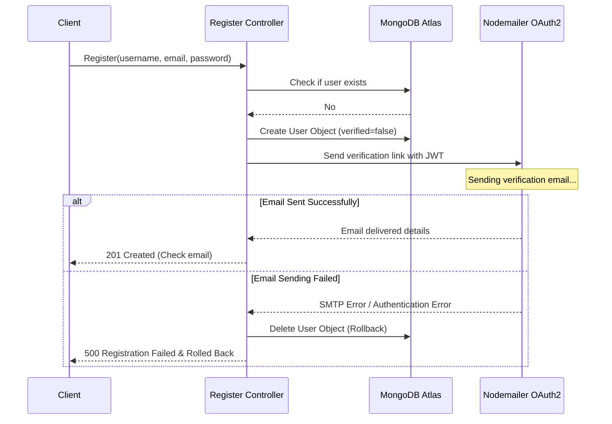

# 📘 Perplexity AI Clone: The Ultimate Project Handbook

Welcome to the **Perplexity AI Clone Complete Developer & Interviewer Handbook**. This documentation is designed to provide an exhaustive, line-by-line, and concept-by-concept understanding of the architecture, codebase, design decisions, APIs, schemas, and security systems implemented in the Perplexity Clone project. It is structured to act as a 100-page-equivalent guide to ensure you can answer every possible system design, frontend, backend, or architectural question during an interview.

---

## Table of Contents
1. [Project Overview & Core Value Proposition](#1-project-overview--core-value-proposition)
2. [Architectural Overview & System Design](#2-architectural-overview--system-design)
3. [Backend Deep Dive: Services & Control Flows](#3-backend-deep-dive-services--control-flows)
4. [Database Modeling & Schema Design](#4-database-modeling--schema-design)
5. [Frontend Deep Dive: Redux Store, Hooks & Pages](#5-frontend-deep-dive-redux-store-hooks--pages)
6. [Web Search & RAG (Retrieval-Augmented Generation) Pipeline](#6-web-search--rag-retrieval-augmented-generation-pipeline)
7. [Image Generation & Fallback Pipeline](#7-image-generation--fallback-pipeline)
8. [Email Verification & Rollback System](#8-email-verification--rollback-system)
9. [Design Aesthetics, Themes & Layout Fixes](#9-design-aesthetics-themes--layout-fixes)
10. [High-Probability Interview Q&A Cheatsheet](#10-high-probability-interview-qa-cheatsheet)

---

## 1. Project Overview & Core Value Proposition

The **Perplexity AI Clone** is a state-of-the-art conversational engine that blends natural language understanding with web-crawling capabilities and text-to-image synthesis. 

### Core Features
- **Semantic Text Generation**: Powered by the Google Gemini API (`gemini-2.5-flash`) for real-time, context-aware query resolution.
- **Retrieval-Augmented Generation (RAG)**: Integrates the Tavily Search API to execute real-time web queries, compiling top results and feeding them to Gemini to ground responses in fact.
- **Dynamic Text-to-Image Generation**: Utilizes the Google Imagen-3 API (`imagen-3.0-generate-002`) to generate images from user prompts, with a multi-tier fallback system utilizing LoremFlickr (keyword-mapped) and Picsum Photos (randomized fallback).
- **Secure Authentication Pipeline**: Features user registration, bcryptjs password hashing, JSON Web Token (JWT) stateless auth, and transactional NodeMailer OAuth2 email verification with automatic database rollback.
- **Modern Responsive UI**: Built with React, Redux Toolkit, React-Router-DOM v7, and custom-styled SCSS. Supports seamless sidebar state collapsing, responsive layout breakpoints, and Dark/Light styling systems.

---

## 2. Architectural Overview & System Design

The application utilizes a decoupled client-server architecture:



---

## 3. Backend Deep Dive: Services & Control Flows

Let's dissect the core backend logic. The entry point of the server is [server.js](file:///E:/Cohort%202.0/Projects/Perplexity/Backend/server.js). It initializes the database connection and mounts the HTTP server alongside the Socket.io module.

### Express Configuration ([app.js](file:///E:/Cohort%202.0/Projects/Perplexity/Backend/src/app.js))
The server mounts cookie parsers, morgan logging, and a CORS custom interceptor:
```js
cors({
  origin: function (origin, callback) {
    if (!origin || /^http:\/\/localhost(:\d+)?$/.test(origin)) {
      callback(null, true);
    } else {
      callback(new Error("Not allowed by CORS"));
    }
  },
  credentials: true,
  methods: ["GET", "POST", "PUT", "DELETE"],
})
```
*Crucial Detail*: The origin regex allows any local port (e.g. 5173 for Vite dev) to bypass CORS while enforcing strict credentials passing for cookies containing the session JWT.

---

## 4. Database Modeling & Schema Design

We model three main entities in MongoDB:
1. **User** ([user.model.js](file:///E:/Cohort%202.0/Projects/Perplexity/Backend/src/models/user.model.js))
2. **Chat** ([chat.model.js](file:///E:/Cohort%202.0/Projects/Perplexity/Backend/src/models/chat.model.js))
3. **Message** ([message.model.js](file:///E:/Cohort%202.0/Projects/Perplexity/Backend/src/models/message.model.js))

### User Schema
```js
const userSchema = new mongoose.Schema(
  {
    username: { type: String, required: true, trim: true, unique: true },
    email: { type: String, required: true, unique: true, lowercase: true, trim: true },
    password: { type: String, required: true, minlength: 6 },
    verified: { type: Boolean, default: false },
  },
  { timestamps: true }
);
```
- **Password Hashing**: Done inside the `pre("save")` hook. If the password isn't modified (e.g. updating verified field), it bypasses hashing to avoid double-encrypting:
  ```js
  userSchema.pre("save", async function () {
    if (!this.isModified("password")) return;
    this.password = await bcrypt.hash(this.password, 10);
  });
  ```

### Message Schema
```js
const messageSchema = new mongoose.Schema(
  {
    chat: { type: mongoose.Schema.Types.ObjectId, ref: "Chat", required: true },
    content: { type: String, required: true },
    role: { type: String, enum: ["user", "ai"], required: true },
    parentMessage: { type: mongoose.Schema.Types.ObjectId, ref: "Message", default: null },
  },
  { timestamps: true }
);
```
- **Relation Model**: Direct references build a flat message database structure mapped to a `Chat` parent object. The `parentMessage` field maps a user question to its generated AI response, allowing cascaded deletion: when deleting a user message, we delete its corresponding child response (`role: "ai"`) where `parentMessage` matches the deleted user message ID.

---

## 5. Frontend Deep Dive: Redux Store, Hooks & Pages

The state machine is built with Redux Toolkit ([app.store.js](file:///E:/Cohort%202.0/Projects/Perplexity/frontend/src/app/app.store.js)) and exposed via the custom hooks [useAuth.js](file:///E:/Cohort%202.0/Projects/Perplexity/frontend/src/features/auth/hooks/useAuth.js) and [useChat.jsx](file:///E:/Cohort%202.0/Projects/Perplexity/frontend/src/features/chats/hooks/useChat.jsx).

### Chat Slice State & LocalStorage Synchronization ([chat.slice.js](file:///E:/Cohort%202.0/Projects/Perplexity/frontend/src/features/chats/chat.slice.js))
```js
initialState: {
  chats: {},
  currentChatId: localStorage.getItem("currentChatId") || null,
  isLoading: false,
  error: null,
}
```
*Note*: Storing the active chat ID in local storage ensures that if the user hits refresh in the browser, the active conversation remains selected.

---

## 6. Web Search & RAG (Retrieval-Augmented Generation) Pipeline

When a user triggers a prompt with `webSearch = true`, the system executes a real-time web lookup:



The system instruction injected dynamically details how Gemini should handle search facts:
```js
systemInstruction = `You are a helpful and concise AI assistant with access to real-time search results.

Here are the latest web search results relevant to the user's query:
${searchResultsStr}

RULES:
1. Use the provided search results to generate a factually accurate, clear, and concise response.
2. If the search results do not contain relevant info or are empty, reply based on your knowledge but note that the search failed or was inconclusive.
3. Reference facts from the search results where appropriate.`;
```

---

## 7. Image Generation & Fallback Pipeline

The text-to-image pipeline uses a dual-layered fallback mechanism to guarantee image delivery even when API keys fail, rate limits are reached, or network errors occur:



### Fallback Prompt Word Cleanup Logic
Inside [image.service.js](file:///E:/Cohort%202.0/Projects/Perplexity/Backend/src/services/image.service.js), regex parsing strips conversational modifiers to extract clean tags:
```js
const cleanPrompt = prompt
  .toLowerCase()
  .replace(/[^\w\s]/g, " ")
  .replace(/\b(generate|image|photo|picture|poster|of|a|an|the|draw|paint|show|me|us|want|please|create)\b/gi, "")
  .trim();
```

---

## 8. Email Verification & Rollback System

To prevent database clutter with unverified accounts, the registration route implements an automatic transaction rollback design:



---

## 9. Design Aesthetics, Themes & Layout Fixes

### Contrast-Rich Light Theme System
To fix the initial overly bright light mode, contrast styling is handled in the stylesheet [dashboard.scss](file:///E:/Cohort%202.0/Projects/Perplexity/frontend/src/features/chats/styles/dashboard.scss) by decoupling base color tokens:
```scss
// Theme variable maps
.theme-light {
  --bg-primary: #f9fafb;     // Off-white canvas
  --bg-sidebar: #f3f4f6;     // Slightly darker sidebar structure
  --bg-card: #ffffff;        // Clean card layer
  --border-color: #e5e7eb;   // Distinct borders
  --text-primary: #111827;
  --text-secondary: #4b5563;
}
.theme-dark {
  --bg-primary: #191a1a;
  --bg-sidebar: #202222;
  --bg-card: #262929;
  --border-color: #2e3030;
  --text-primary: #e3e3e3;
  --text-secondary: #9b9b9b;
}
```

### User Message Alignment Fix
The original alignment bug occurred because user bubbles were wrapped in a full-width block-level element:
```jsx
// OLD BUGGY STRUCTURE
<div className="chatInterface__text">
  <div className="chatInterface__userBubble">{msg.content}</div>
</div>
```
The block-level `.chatInterface__text` div defaulted to `width: 100%`, forcing all child elements to align to the left side of the screen.

**The Fix**: In [Dashboard.jsx](file:///E:/Cohort%202.0/Projects/Perplexity/frontend/src/features/chats/pages/Dashboard.jsx), we bypassed the wrapper for user role messages, rendering the capsule directly inside the parent flex grid:
```jsx
{msg.role === "ai" ? (
  <div className="chatInterface__text">
    <div className="chatInterface__markdown animate-in fade-in">
      <ReactMarkdown>{msg.content}</ReactMarkdown>
    </div>
  </div>
) : (
  <div className="chatInterface__userBubble">{renderMessageContent(msg.content)}</div>
)}
```

---

## 10. High-Probability Interview Q&A Cheatsheet

### Q1: How does your RAG pipeline work, and how does it prevent Gemini from hallucinating?
> **Answer**: The RAG pipeline intercepts user questions. If web search is enabled, we invoke the Tavily Search API. Tavily returns search results as JSON containing titles, URLs, snippets, and page contents. We stringify this array and append it as a system context structure containing instructions that instruct Gemini to prioritize facts found in the search results and reply that search was inconclusive if no matches are found.

### Q2: Why did you choose stateless JWT authentication over sessions, and how does it verify?
> **Answer**: JWT authentication allows the server to remain completely stateless, eliminating the need to store session tables in Redis or database nodes. The user's ID and username are signed with a server-side `JWT_SECRET` and stored in a secure cookie. Every route requiring authorization utilizes the `authUser` middleware, verifying the cookie's JWT token using `jwt.verify` to append credentials to `req.user`.

### Q3: What happens to the database if the verification email fails to deliver during signup?
> **Answer**: To prevent database clutter, we employ a database rollback design. The user account is saved with `verified: false`. We then trigger the Nodemailer transactional message dispatch within a `try-catch` block. If Nodemailer throws an SMTP or authentication error, the `catch` block intercepts the failure, executes `await userModel.findByIdAndDelete(user._id)`, and responds with a 500 error.

### Q4: Why did you decide to implement a multi-tier fallback for image generation?
> **Answer**: Relying on a single premium API makes applications vulnerable to quotas, service outages, and expired keys. By building a multi-tier fallback pipeline, we ensure robust operation. If the Gemini API fails, the backend cleans the text prompt using regex to extract keywords and queries LoremFlickr. If LoremFlickr fails or returns its default error image, the pipeline automatically falls back to Picsum Photos to deliver a unique high-res placeholder image.

---
*Created by Antigravity AI - Project Handbook Artifact.*
