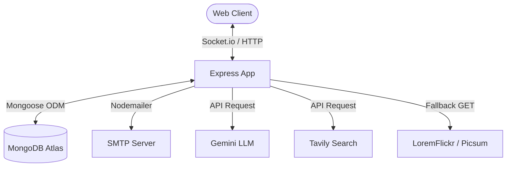

# Developer Interview Handbook: Perplexity Clone

This handbook provides a deep dive into the architecture, design choices, key engineering challenges, and technical details of the **Perplexity Clone** project. It is structured to help you answer any full-stack developer interview question w.r.t. this codebase.

---

## 1. Project Overview & Architecture

The application is a full-stack **Perplexity-style AI search and image generation dashboard**. It features real-time model streaming, collapsible navigation, history persistence, web search integration, and a fallback image generation pipeline.

### Technical Stack
*   **Frontend**: React 19, Redux Toolkit (state management), React Router 7, Vite (build tool), SCSS (Vanilla CSS prepended with SCSS modular rules).
*   **Backend**: Node.js, Express, MongoDB (via Mongoose ODM), Socket.io (real-time communication).
*   **APIs**: Google Gemini Developer API (text generation), Tavily Search API (real-time web indexing/search), LoremFlickr & Picsum Photos (fallback assets).

### System Architecture Diagram


---

## 2. Directory Structure

### Backend Layout
*   `server.js`: Application entry point. Boots Express and Socket.io servers.
*   `src/app.js`: Configures CORS dynamically, setups cookie parsers, parses JSON payloads, sets up static file serving (for generated images), and routes HTTP endpoints.
*   `src/services/`:
    *   [ai.service.js](file:///E:/Cohort%202.0/Projects/Perplexity/Backend/src/services/ai.service.js): Interacts with Gemini API for chat titles and AI streaming responses.
    *   [internet.service.js](file:///E:/Cohort%202.0/Projects/Perplexity/Backend/src/services/internet.service.js): Queries the Tavily Search API to scrape live web results.
    *   [image.service.js](file:///E:/Cohort%202.0/Projects/Perplexity/Backend/src/services/image.service.js): Implements Gemini `imagen-3.0` API with a custom multi-tier fallback.
*   `src/sockets/`: Real-time socket handlers for chat message streaming.
*   `src/models/`: Database models for `User`, `Chat` metadata, and `Message` history.

### Frontend Layout
*   `src/features/auth/`: Contains Login and Register pages.
*   `src/features/chats/`:
    *   [Dashboard.jsx](file:///E:/Cohort%202.0/Projects/Perplexity/frontend/src/features/chats/pages/Dashboard.jsx): The main application view. Renders collapsible sidebar, message lists, and floating pill input.
    *   [useChat.jsx](file:///E:/Cohort%202.0/Projects/Perplexity/frontend/src/features/chats/hooks/useChat.jsx): Custom React hook that encapsulates socket connections, deletes, image generation requests, and Redux sync.
    *   [chat.slice.js](file:///E:/Cohort%202.0/Projects/Perplexity/frontend/src/features/chats/chat.slice.js): Redux slice containing action creators and reducers for chats and messages.
    *   [dashboard.scss](file:///E:/Cohort%202.0/Projects/Perplexity/frontend/src/features/chats/styles/dashboard.scss): Minimalist styling sheets matching ChatGPT's design system.

---

## 3. Core Technical Implementations

### A. Authentication & Session Persistence
*   **Mechanism**: JWT tokens saved in HttpOnly cookies to mitigate XSS (Cross-Site Scripting).
*   **Sync**: On page reload, the frontend initiates a validation check (`/api/auth/me`). If successful, it populates user state in Redux; otherwise, it redirects to the login screen.
*   **Chat History Sync**: The selected `currentChatId` is persisted in `localStorage` so that refreshing keeps the active conversation loaded rather than defaulting to a blank state.

### B. Live AI Web-Enhanced Queries
*   When **Search Mode** is toggled on, the backend runs a dual-step pipeline:
    1.  **Retrieve Context**: Queries the **Tavily API** with the user's prompt to fetch clean, relevant, and condensed summaries of the latest web results.
    2.  **Augmented Generation**: Formulates a detailed system prompt injecting the retrieved context before calling the Gemini LLM. This prevents hallucination and allows the AI to answer questions w.r.t. recent events (e.g., *IPL 2026 squads*).

### C. Multi-Tier Image Fallback Pipeline
*   **Standard path**: Requests are sent to the Gemini Developer API (`imagen-3.0-generate-002`).
*   **Edge-case Handling**: Since legacy beta models are occasionally decommissioned or run out of quota, we built a robust fallback pipeline:
    *   **Keyword Extraction**: Trims generic phrases (`"create a poster..."`) to yield targeted tags.
    *   **Tier 1 (LoremFlickr)**: Fetches tag-relevant images.
    *   **Tier 2 (LoremFlickr Fail / 500 / Tag Miss)**: Detects errors (Status 500), redirects, or default placeholder dimensions (specifically catching the static `126099` byte length default image) and instantly falls back to **Picsum Photos** (`https://picsum.photos/800/600`).
    *   **Cache-Busting**: Appends random hashes (`?random=...`) to defeat CDN caches, guaranteeing a unique image on every call.

---

## 4. Key Engineering Challenges Solved

Below are the high-difficulty bugs and design obstacles solved in this codebase. Mentioning these in interviews will show deep troubleshooting capability.

### Challenge 1: Dynamic CORS Port Binding
> [!WARNING]
> **Problem**: During local runs, Vite may fail to claim port `5173` due to port conflicts and fall back to `5174` or `5175`. A hardcoded CORS configuration in Express (`http://localhost:5173`) causes requests from dynamic ports to block, logging out users on refresh.
>
> **Solution**: Refactored the CORS configuration in [app.js](file:///E:/Cohort%202.0/Projects/Perplexity/Backend/src/app.js) to dynamically match incoming request origins matching the localhost loopback pattern:
> ```javascript
> const corsOptions = {
>   origin: function (origin, callback) {
>     if (!origin || /^http:\/\/localhost:\d+$/.test(origin)) {
>       callback(null, true);
>     } else {
>       callback(new Error('Not allowed by CORS'));
>     }
>   },
>   credentials: true
> };
> ```

### Challenge 2: Redux Loading Race Conditions on Refresh
> [!NOTE]
> **Problem**: When a user refreshed the dashboard, their active chat was wiped from view. This happened because the HTTP request fetching all chats competed with the socket connection loading the active message stream. Redux was overriding local state arrays with blank/stale loads before the initial state completed fetching.
>
> **Solution**: Configured synchronization hooks in [chat.slice.js](file:///E:/Cohort%202.0/Projects/Perplexity/frontend/src/features/chats/chat.slice.js). We persisted the current active chat ID in local storage and checked if the retrieved chat list from the server populated it. If found, we fetched its messages; otherwise, we safely cleared or reset the state, preventing any racing state overrides.

### Challenge 3: HTML Block Layout Wrapper Interference
> [!CAUTION]
> **Problem**: User messages were not aligning properly to the right side of the chat layout (appearing centered or slightly shifted). This happened because user message bubbles were wrapped in a generic `.chatInterface__text` div, which spanned the full width of the parent flexbox container and aligned children to the left by default.
>
> **Solution**: Bypassed the `.chatInterface__text` div wrapper for user messages in the JSX render function in [Dashboard.jsx](file:///E:/Cohort%202.0/Projects/Perplexity/frontend/src/features/chats/pages/Dashboard.jsx#L410-L425). We placed `.chatInterface__userBubble` as a direct child of the `.chatInterface__message--user` flex container, allowing the bubble to shrink-wrap its width to fit the content and align perfectly to the right (`align-items: flex-end`).

### Challenge 4: SCSS Ancestor Nesting Selector Bug
> [!TIP]
> **Problem**: The active toggle switch knob for Search Mode (Tavily) failed to slide to the right or change color even when the search option was active. The SCSS compiled to `.chatInterface__toggleContainer--active .chatInterface__toggleContainer .chatInterface__toggleSwitch` due to nesting the ancestor reference selector `&` inside the switch definition.
>
> **Solution**: Moved the active switch selector mapping directly under the `&--active` block of the container in [dashboard.scss](file:///E:/Cohort%202.0/Projects/Perplexity/frontend/src/features/chats/styles/dashboard.scss#L1034-L1050), which compiles correctly to `.chatInterface__toggleContainer--active .chatInterface__toggleSwitch`.

---

## 5. Potential Interview Q&A (Prep Guide)

### Q1: How did you implement authentication in this app, and why did you choose that approach?
**A-Grade Answer**:
> "I implemented cookie-based JWT (JSON Web Token) authentication. When a user logs in, the server generates a token and returns it in an `HttpOnly` cookie. This approach is superior to storing JWTs in `localStorage` because `HttpOnly` cookies are inaccessible to browser scripts, protecting the user session against Cross-Site Scripting (XSS) attacks. On the frontend, we use an authentication slice in Redux to keep track of user metadata, and we make a validation call on initial loading to restore the session if the cookie is still valid."

### Q2: What was the most challenging bug you faced during development, and how did you solve it?
**A-Grade Answer**:
> "One of the trickiest bugs was a state sync issue during page refreshes on the Dashboard. When users refreshed the browser, the current active conversation would display as empty or disappear. I discovered a race condition between the HTTP request loading the sidebar conversation list and the Redux state hydration.
> To fix this, I implemented state synchronization in the Redux slice. I stored the active chat ID in `localStorage` upon selection. During the dashboard mount phase, the hook reads this ID, validates its existence in the loaded chats array, and initiates a clean load of messages from that specific conversation, avoiding race conditions or overwriting state arrays with stale data."

### Q3: Explain why you chose Socket.io over standard HTTP polling for streaming messages.
**A-Grade Answer**:
> "Socket.io allows us to establish a persistent, bidirectional WebSocket connection. Standard HTTP polling requires the client to make recurrent requests to the server (e.g., every 2 seconds), which introduces significant latency, bloats headers, and places heavy load on the server.
> Using Socket.io, we can stream tokens (chunks of text) from the LLM to the UI in real time. As soon as a token is ready on the backend, we emit it. The client listens and appends it dynamically, creating a fast and fluid chat interface exactly like ChatGPT or Perplexity."

### Q4: How does your image generation feature handle API key failures or model deprecation?
**A-Grade Answer**:
> "Third-party AI endpoints (like Gemini’s Imagen) are prone to deprecation or quota issues. To prevent the service from breaking, I engineered a double-tier fallback pipeline.
> The backend attempts to call the Gemini API first. If it fails, it catches the error and queries LoremFlickr with parsed keywords from the prompt. However, if LoremFlickr fails or returns a tag miss (which is redirected to a default error image of a static file size), the code detects this and falls back to Picsum Photos. We append a random buster hash to avoid CDN caches, ensuring the user always receives a unique, high-quality image on subsequent requests."

### Q5: How did you optimize the CSS layouts for a clean, minimalist experience?
**A-Grade Answer**:
> "We chose a flat layout inspired by ChatGPT. Rather than nesting messages inside heavy cards, AI messages are rendered directly on the viewport background with clean typography.
> For user bubbles, we used CSS Flexbox. We encountered an issue where wrapper div containers interfered with flexbox inheritance, stretching the bubbles to full width. By streamlining the JSX tree and placing the user bubble as a direct child of the flex container, we achieved an aligned layout where bubbles automatically shrink-wrap to the length of the text and align to the right, retaining responsiveness on mobile devices."

---

## 6. Key Takeaways to Highlight
*   **API Resilience**: Show you don't just consume APIs; you build fallback routes when APIs go offline or exceed rates.
*   **State Management Hydration**: Highlight your understanding of race conditions between UI state, Redux, and local storage.
*   **Performance & Realtime**: Focus on WebSockets (Socket.io) to deliver live, lightweight, responsive streaming.
*   **SCSS Expertise**: Emphasize how clean compiled selectors translate to responsive UI designs.
